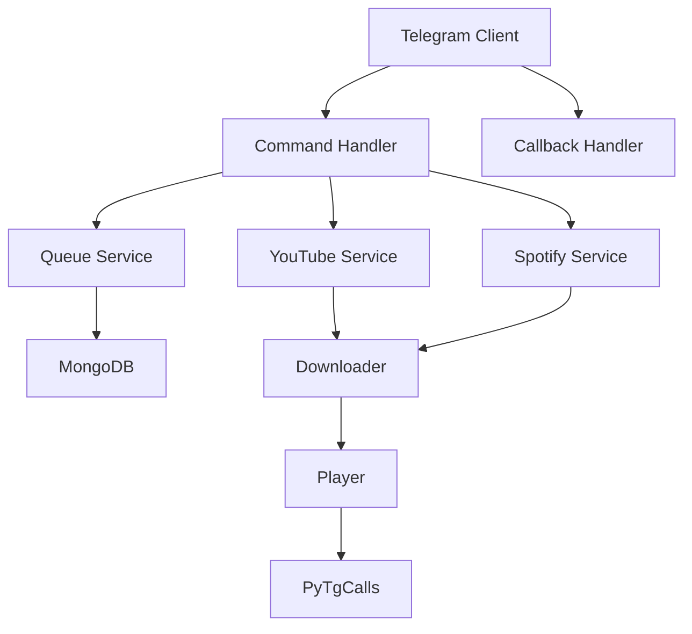

# 🎵 Music Bot - Telegram Voice Chat Bot

A feature-rich Telegram bot for playing music in voice chats, supporting YouTube, Spotify, and direct audio links with advanced queue management and playback controls.

<!--  *Example: Playing music in a voice chat*  -->

## 🌟 Features

- **Multi-Source Playback**
  - YouTube videos and playlists
  - Spotify tracks and playlists
  - Direct audio links (MP3, M3U8, etc.)
  - Live stream support

- **Advanced Queue System**
  - Dynamic queue management
  - Per-user queue limits
  - Queue position manipulation
  - Persistent queue storage

- **Playback Controls**
  - Play/Pause/Resume
  - Volume adjustment
  - Seeking within tracks
  - Loop modes (none/track/queue)

- **User Management**
  - Admin controls
  - User-specific settings
  - Playlist saving
  - Voting system (skip votes)

- **Technical Features**
  - IP rotation to prevent blocking
  - Automatic file cleanup
  - Multi-language support
  - Detailed analytics

## 🚀 Installation

### Prerequisites
- Python 3.8+
- MongoDB 4.4+
- FFmpeg
- Telegram API credentials

### Setup

1. Clone the repository:
   ```bash
   git clone https://github.com/Pranav-Saraswat/music-bot.git
   cd music-bot
   ```

2. Install dependencies:
   ```bash
   pip install -r requirements.txt
   ```

3. Configure the bot:
   ```bash
   cp .env.example .env
   nano .env  # Edit with your credentials
   ```

4. Start the bot:
   ```bash
   python main.py
   ```

## ⚙️ Configuration

Key environment variables (`.env` file):

```ini
# Telegram
API_ID=12345
API_HASH="your_api_hash"
SESSION_NAME="your_session_string"

# Database
DATABASE_URL="mongodb://localhost:27017"

# Services
YOUTUBE_API_KEY="your_key"
SPOTIFY_CLIENT_ID="your_id"
SPOTIFY_CLIENT_SECRET="your_secret"

# Behavior
MAX_CONCURRENT_DOWNLOADS=3
DEFAULT_VOLUME=80
```

## 📋 Commands

### Basic Commands
- `/play [query]` - Play a song
- `/vplay [query]` - Play video
- `/skip` - Skip current track
- `/pause` - Pause playback
- `/resume` - Resume playback
- `/queue` - Show current queue
- `/now` - Currently playing track

### Advanced Commands
- `/seek [time]` - Seek to position
- `/volume [1-200]` - Adjust volume
- `/loop [none/track/queue]` - Set loop mode
- `/shuffle` - Shuffle queue
- `/remove [position]` - Remove track

### Admin Commands
- `/clean` - Clear temporary files
- `/restart` - Restart the bot
- `/ban [user]` - Ban a user
- `/unban [user]` - Unban a user

## 🧩 Architecture



## 🌐 Deployment

### Docker
```bash
docker-compose up -d
```

### Systemd Service
```ini
# /etc/systemd/system/musicbot.service
[Unit]
Description=Music Bot
After=network.target

[Service]
User=musicbot
WorkingDirectory=/path/to/bot
ExecStart=/usr/bin/python3 main.py
Restart=always

[Install]
WantedBy=multi-user.target
```

## 📊 Monitoring

The bot provides several monitoring endpoints when `METRICS_ENABLED=true`:

- `/metrics` - Prometheus metrics
- `/health` - Health check
- `/stats` - Performance statistics

## 🤝 Contributing

1. Fork the repository
2. Create your feature branch (`git checkout -b feature/AmazingFeature`)
3. Commit your changes (`git commit -m 'Add some amazing feature'`)
4. Push to the branch (`git push origin feature/AmazingFeature`)
5. Open a Pull Request

## 📜 License

Distributed under the MIT License. See `LICENSE` for more information.

## 📧 Contact

Project Maintainer - [Your Name](mailto:your.email@example.com)

Project Link: [https://github.com/yourusername/music-bot](https://github.com/yourusername/music-bot)
